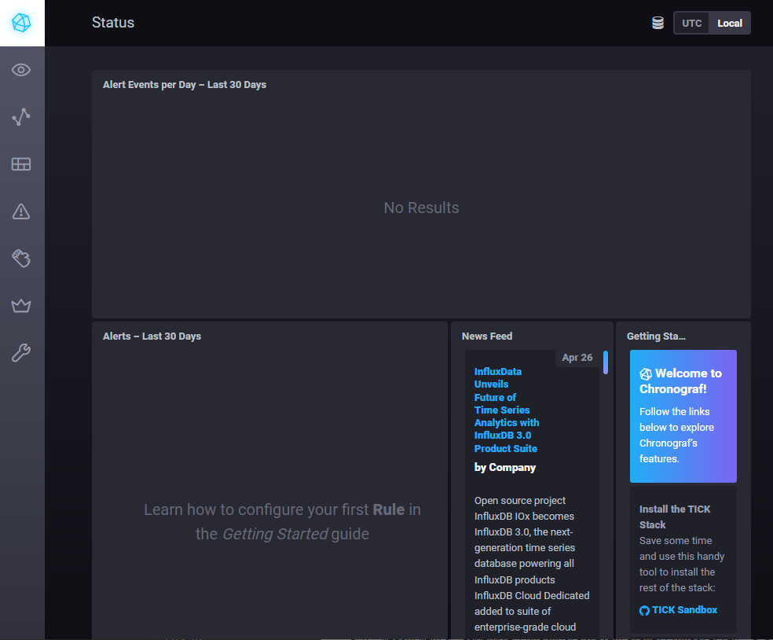

# Решение

1. Вас пригласили настроить мониторинг на проект. На онбординге вам рассказали, что проект представляет из себя платформу для вычислений с выдачей текстовых отчётов, которые сохраняются на диск. 
Взаимодействие с платформой осуществляется по протоколу http. Также вам отметили, что вычисления загружают ЦПУ. Какой минимальный набор метрик вы выведите в мониторинг и почему?

  - Предложу использовать 4 золотые метрики и метрику дисковой системы:
    - Скорость отклика по http
        Причина: Т.к. система доступна по http, значит она взаимодействует с конечными пользователями. Конечный пользлователь оценивает работу системы по скорости отклика на свои запросы. Только наблюдая достижение допустимого времени отклика мы сможем сказать, что нашли и устранили проблему.
    - Размер трафика
        Причина: Т.к. Высокая загруженность ЦПУ может быть связана с увеличением количества запросов. В этом случае нужно будет добавить не ЦПУ, а дополнительный сервер и сформировать веб-кластер. 
    - Количество 400/500 ошибок
        Причина: Высокую загруженность ЦПУ могут вызывать ошибки в приложении(утечка памяти, зацикливание и т.п.)
    - Загрузка процессора
        Причина: Т.к. отмечается высокая загрузка ЦПУ. Используя показатель загруженности ЦПУ можно контролировать появление или устранение проблем производительности, на которые жалуются пользователи.
    -  Загрузка дисковой системы(особенно актуальным является среднее количество операций чтения/записи в секунду. Если показатель чтения превышает 0,010-0,015 операции в секунду, то    можно считать дисковую систему узким местом в производительности. У нас такая ситуация была связана с ошибками в файловых дескрипторах).
        Причина: Т.к. система сохраняет отчеты на диск. Для мониторинга необходимо контролироват все элементы системы.

2. Менеджер продукта, посмотрев на ваши метрики, сказал, что ему непонятно, что такое RAM/inodes/CPUla. Также он сказал, что хочет понимать, насколько мы выполняем свои обязанности    перед клиентами и какое качество обслуживания. Что вы можете ему предложить?
  - Предложу определить для клиентов SLA как 99% успешно выполненных запросов.

3. Вашей DevOps-команде в этом году не выделили финансирование на построение системы сбора логов. Разработчики, в свою очередь, хотят видеть все ошибки, которые выдают их приложения. Какое решение вы можете предпринять в этой ситуации, чтобы разработчики получали ошибки приложения?
  - Предложу разработчикам добавить логирование выполнения их кода.
4. Вы, как опытный SRE, сделали мониторинг, куда вывели отображения выполнения SLA = 99% по http-кодам ответов. 
Этот параметр вычисляется по формуле: summ_2xx_requests/summ_all_requests. Он не поднимается выше 70%, но при этом в вашей системе нет кодов ответа 5xx и 4xx. Где у вас ошибка?
  - В формуле не учитываются запросы  перенаправлений соединений, которые идут с 3xx кодами. Правильная формула должна быть:
    (summ_2xx_requests+summ_3xx_requests)/summ_all_requests

5. Опишите основные плюсы и минусы pull и push систем мониторинга.
  - Плюсы push мониторинга:
    - На агентах можно указать несколько точек отправки метрик
    - Можно настраивать параметры отправки метрик(частоту и объем данных)
    - Отправка как правило осуществляется по UDP, поэтому потребляет меньше сетевых ресурсов(размер пакетов меньше)
  - Минусы push-мониторинга:
    - При отправке по UDP могут теряться часть данных
    - Агенты на узлах мониторинга создают большую нагрузку по сравнению с pull-моделью 
  - Плюсы pull-мониторинга
    - Т.к. сбор логов осуществляется путем опроса агентов мониторинга, все настройки хранятся централизовано. *Настройки проще контролировать и менять.*
    - Можно настроить единый прокси для отправки данных туда и собирать их для анализа уже с прокси. *Высокая надежность доставки данных.*
    - *Упрощенная отладка получения данных с агентов*
    - Т.к. агенты только собирают и отправляют данные, то *меньше нагрузка на конечные узлы*
  - Минусы pull-мониторинга
    - Увеличенный сетевой трафик по сравнению с push моделью
    - Меньшая гибкость настройки отправки данных с агентов

6. Какие из ниже перечисленных систем относятся к push модели, а какие к pull? А может есть гибридные?

    - Prometheus (может работать как по push так и по pull модели, хотя по умолчанию работает по pull-модели. Поддерживает сложные запросы. *Гибридная.*)
    - TICK (работает по *push модели*.)
    - Zabbix (может работать как по push так и по pull модели. Гибридная.)
    - VictoriaMetrics(по умолчанию работает по push модели, но поддерживает работу и pull-модели. В отличие от prometheus поддерживает предоставление информации об аномалиях в метричных данных. *Гибридная.*)
    - Nagios (Работает по push модели. Имеет большое количество плагинов и легко расширяема под любые системы мониторинга в отличие от prometheus. *Push-модель* )

7. После входа в chronograf по адресу http://localhost:8888 видим вот такую стартовую страницу:

8. После добавления метрики cpu на вкладке *Explore* видим следующую картину:

9. В разделе *telegraf.autogen* появились метрики docker:

10. Дополнительное задание 2

Добавлен дашборд по метрикам Docker:

